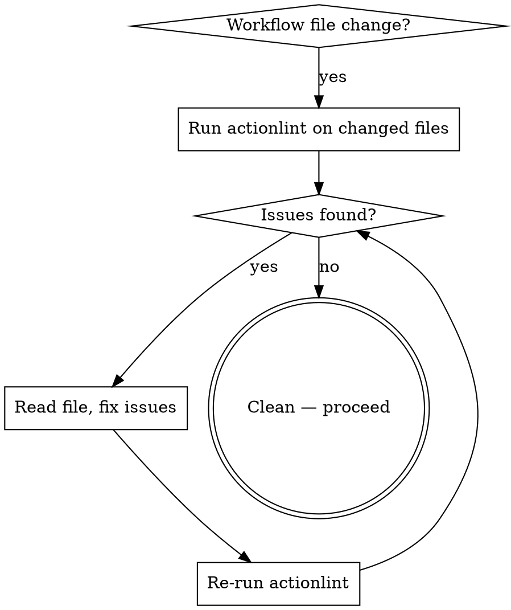

# Review GitHub Actions Workflows

## Overview

**Run `actionlint` before and after any workflow file change.** Static analysis catches expression errors, deprecated commands, shellcheck issues, and invalid references that are invisible to manual review and only surface as runtime failures in CI.

## When to Use

- Editing any `.github/workflows/*.yml` file
- Reviewing a PR that touches workflow files
- Debugging CI/CD failures
- User asks to review or lint GitHub Actions

## Core Workflow



## Commands

```bash
# Lint all workflows in repo
actionlint

# Lint specific file
actionlint .github/workflows/deploy-production.yml

# JSON output (for programmatic use)
actionlint -format '{{json .}}'

# Ignore specific rules
actionlint -ignore 'SC2086' .github/workflows/deploy.yml
```

## Quick Reference: Common Issues

| Category | Example | Fix |
|----------|---------|-----|
| `deprecated-commands` | `::set-output name=X::V` | Use `echo "X=V" >> $GITHUB_OUTPUT` |
| `events` | `default` + `required` on input | Remove `default` or `required` |
| `expression` | Case mismatch in `secrets['NAME']` | Match exact case from secrets config |
| `shellcheck` | Unquoted variable in `run:` | Double-quote: `"${VAR}"` |
| `syntax` | Invalid YAML structure | Fix indentation/structure |
| `permissions` | Missing `permissions:` key | Add explicit permissions block |
| `credentials` | Hardcoded secrets in workflow | Use `${{ secrets.NAME }}` |

## Security Review Checklist

When reviewing workflow files, also check for issues actionlint doesn't catch:

- **Expression injection**: Never use `${{ github.event.*.title }}`, `${{ github.event.*.body }}`, or other untrusted inputs directly in `run:` blocks. Assign to `env:` first.
- **Overly broad permissions**: Use least-privilege `permissions:` — don't use `write-all`.
- **Pull request target triggers**: `pull_request_target` + `actions/checkout@HEAD` = code execution from forks.
- **Unpinned actions**: Prefer `actions/checkout@v4` over `actions/checkout@main`. Pin to SHA for third-party actions.
- **Secret exposure**: Secrets in `run:` blocks can leak via `set -x` or error messages.

## Common Mistakes

**Ignoring shellcheck warnings.** SC2086 (unquoted variables) in `run:` blocks can cause word splitting with spaces in branch names or commit messages. Always quote.

**Trusting `github.event.before` blindly.** On force-pushes, `github.event.before` may point to a commit no longer in the branch. Validate before using for rollback.

**Not re-running after fixes.** Always re-run `actionlint` after making changes — fixes can introduce new issues (e.g., fixing YAML indentation can shift other blocks).
