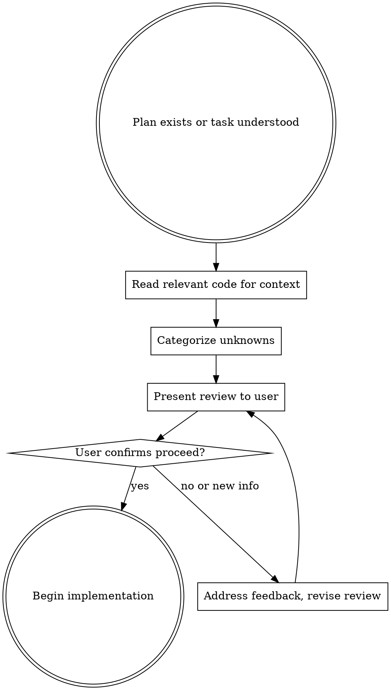

# Pre-Implementation Review

## Overview

**Before writing any code, pause and surface every question, assumption, edge case, and nuance to the user.** Implementation quality is determined before the first line is written — by what you chose to ask about and what you silently assumed.

This is a deliberate checkpoint between understanding and execution. Reading code is not the same as surfacing uncertainties. You can fully understand HOW to implement something and still have critical gaps about WHAT should be implemented.

<HARD-GATE>
Do NOT write implementation code, create files, or make code changes until you have presented your pre-implementation review and the user has confirmed to proceed. This applies even when told "just implement it," "go ahead," or "this is simple."
</HARD-GATE>

## When to Use

**Always use when:**

*   You have a plan and are about to start coding
*   User says "go ahead and implement"
*   You think "I know enough to start"
*   A task has been described and you're ready to execute

**Skip only when:**

*   Single-line fix with zero ambiguity (typo, obvious syntax error)
*   User explicitly says "skip the review, I've thought through everything"

## Process Flow



## The Review Checklist

Surface items in these categories. Not every category will have items — skip empty ones. But you MUST actively consider each:

### 1. Assumptions I'm Making

What am I treating as decided that was never explicitly stated?

*   Default behaviors not specified
*   Scope boundaries not defined
*   "Obvious" choices that could go either way

### 2. Ambiguous Requirements

Where could the task description mean more than one thing?

*   Vague terms ("handle," "support," "manage")
*   Missing acceptance criteria
*   Undefined error/edge behavior

### 3. Edge Cases and Nuances

What happens at the boundaries?

*   Empty/null/missing data
*   Concurrent operations
*   Existing data that predates this change
*   Permission boundaries

### 4. Impact on Existing Behavior

What could this change break or affect?

*   Related features that depend on current behavior
*   Event handlers that react to the entities being changed
*   Frontend assumptions about data shape

### 5. Open Questions

Anything that would change the implementation approach if answered differently.

## Presentation Format

Present the review as a concise, structured message:

```markdown
Before implementing, I want to surface a few things:

**Assumptions:**
- [assumption 1 — and what I'll do if wrong]
- [assumption 2]

**Questions:**
- [question that would change the approach]
- [ambiguity that needs clarification]

**Nuances I noticed:**
- [edge case or subtlety worth flagging]

Shall I proceed with these assumptions, or would you like to adjust anything?
```

**Scale the review to the task.** Simple tasks (well-specified, narrow scope): 2-3 items. Complex tasks (cross-cutting, ambiguous scope): 5-8 items. Every item should be something that would change your implementation if answered differently. If it wouldn't change anything, don't list it.

## Red Flags — STOP and Do the Review

These thoughts mean you're about to skip the review:

| Thought | Reality |
|---------|---------|
| "I already read the code, I understand it" | Understanding HOW is not understanding WHAT or WHY. Surface the WHAT/WHY questions. |
| "The user said 'just implement it'" | They want quality implementation, not skipped due diligence. The review IS part of implementing. |
| "This is straightforward" | Straightforward tasks have the most dangerous silent assumptions. |
| "I'll figure it out as I go" | Figuring it out mid-implementation means rework. Surface it now. |
| "I don't want to seem slow" | Asking smart questions signals competence, not slowness. |
| "The plan already covers everything" | Plans describe WHAT to build. They rarely cover every edge case and assumption. |
| "Reading the code answered my questions" | Code shows current behavior, not intended behavior for the new feature. |
| "I can always ask later" | Asking after writing 200 lines means potentially rewriting 200 lines. |

## Common Mistakes

**Burying questions at the end of an implementation plan.** Questions must come BEFORE the plan, not as footnotes after it. If you present "here's what I'd build" followed by "oh and here are some questions," the user focuses on the plan and glosses over the questions.

**Only surfacing technical blockers, not business ambiguities.** A wrong field name forces you to stop. But "should cancelled orders still appear in reports?" is a business question that won't stop you technically — you'll just silently pick one answer. Surface both.

**Listing every possible concern.** The review should be focused on items that would change your implementation. If an assumption wouldn't change anything regardless of the answer, don't list it.

**Doing a perfunctory review to satisfy the rule.** The review is not a checkbox. Each item should be a genuine uncertainty you discovered by reading the code and thinking about the requirements. If you can't find real concerns, the task may genuinely be trivial — but verify by checking the code first.
